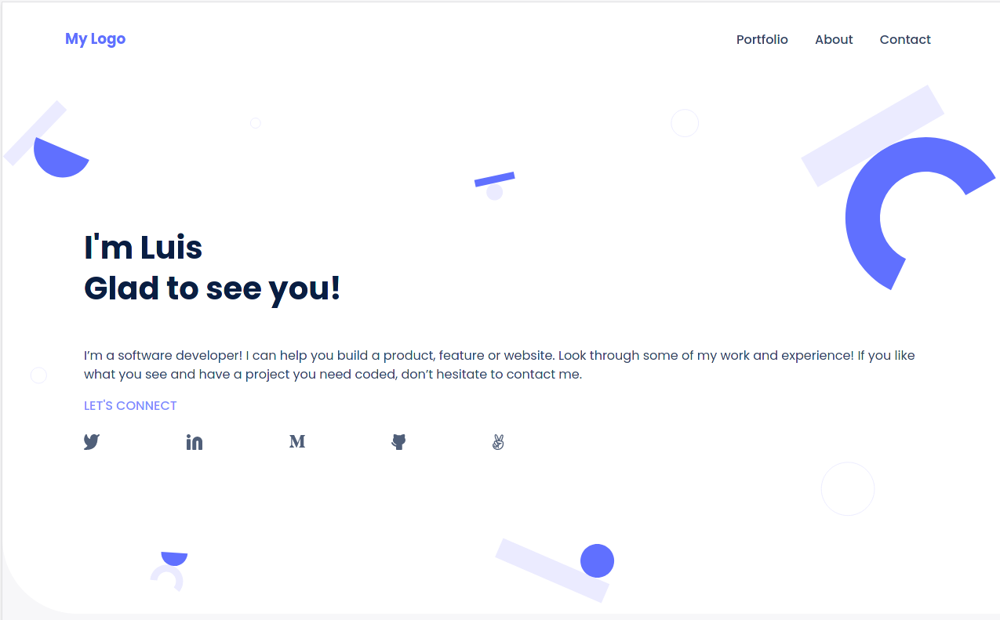

# Luis's portfolio

> This project is part of a larger project to build a portfolio following a Figma template for both desktop and mobile. The purpose for this particular section is to create the skeleton for the mobile version

Additional description about the project and its features.

## Built With

- HTML&CSS
- Flexbox

## Getting Started

To get a local copy up and running follow these simple steps.

### Prerequisites
- Having a modern internet browser: I.E. Chrome, Edge, Safari, Firefox.

### Setup
- Go into the main page for this project: https://github.com/lu-jim/hello-microverse
- Click the green Code button next to the About section.
- Select the then click the 📋 button.
### Install
- Open your console and change the current working directory into the destination for this project.
- Type `git clone`, and then paste the URL copied in the Setup section.
- Type Enter to finish the installation process.

## Authors

👤 **Luis Fernando Jimenez**

- GitHub: [@lu-jim](https://github.com/lu-jim)
- Twitter: [@lujimhe](https://twitter.com/lujimhe)
- LinkedIn: [LinkedIn](https://www.linkedin.com/in/lujim/)

## 🤝 Contributing

Contributions, issues, and feature requests are welcome!

Feel free to check the [issues page](../../issues/).

## Show your support

Give a ⭐️ if you like this project!

## Acknowledgments

- Microverse for the guidelines used for this project
- My SO, Mane

## 📝 License

This project is [MIT](./MIT.md) licensed.
